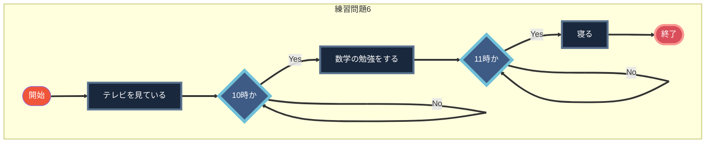
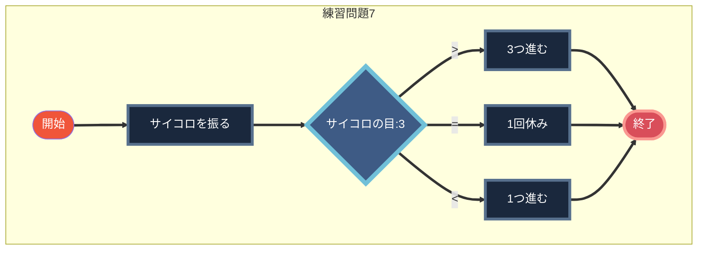

# 概要

本課題は、有償ソフトウェアTyporaに搭載されているMermaid機能を利用して作成を行った。

Github上でプレビューして参照することが可能である。

https://github.com/shion1305/2022_YNUB2_Programming_Exercises_I/tree/master/Lesson1

# 練習問題6



# 練習問題7



# 練習問題8

```mermaid
graph TD
    subgraph 練習問題8
    A1([開始]):::Start ==>B1[数字を入力する]
    B1:::Operation ==> C1{入力データ:5}
    C1:::Switch ==>| > | D1[引き算をする]:::Operation ==> G1([終了])
    C1 ==>| = | E1[音を鳴らす]:::Operation ==> G1
    C1 ==>| < | F1[足し算をする]:::Operation ==> G1:::End
    end
classDef Start fill:#f0553a,color:white
classDef Operation fill:#1a283d,stroke:#57708d,color:white,stroke-width:4px
classDef Switch fill:#3e5b85,stroke:#70c0d8,color:white,stroke-width:6px
classDef End fill:#d94e5a,stroke:#fa9891,color:white,stroke-width:4px
````

