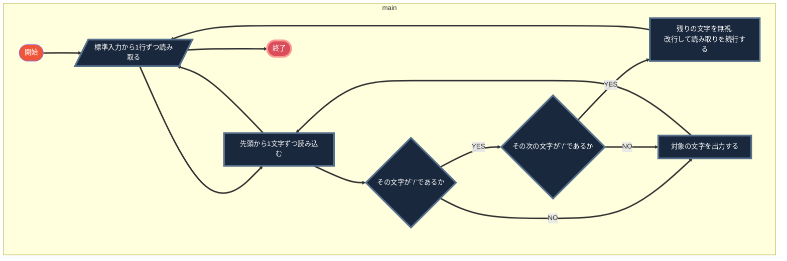

# プログラミング演習Ⅰ 第7回課題

今回のレポート課題は本日の基本課題 4. ( コメントを除去するプログラム )
に対応して作成したプログラムについて、
以下の 5 ( + オプション 2 ) つの章の内容をについて記しなさい。
提出のファイル形式は、Wordでもpdfでもplain textでも構わない。
( plain text の場合にはフローチャートの図も一緒に画像ファイルで提出すること )

(1) 課題番号と課題内容
(2) フローチャートによるアルゴリズムの記述
(3) アルゴリズムが「正しいこと」である説明または証明
(4) ソース・プログラムの説明
(5) 考察
(6) 参考文献、参照情報、謝辞等があれば項目を追加 ( オプション )
(7) 感想、要望等があれば項目を追加 ( オプション )

を書いて下さい。

【 注意事項 】
「(4) プログラムの説明」と「(2) アルゴリズムの記述」とは違うものであることに注意してください。
「プログラムの説明」は、作成したプログラムの各部を説明するものであるのに対して、
「アルゴリズムの記述」は、そのプログラムを作成する際に採用した
「問題の解き方。解くための手順」の記述 ( 説明 ) になります。

また、「(2) アルゴリズムの記述」と「(3) アルゴリズムが正しいことの説明」
も異なります。
「アルゴリズムが正しいことの説明」には、採用したアルゴリズムが
「正しいこと」であることを言葉で説明したり、数学的に証明しても
構いません。

「アルゴリズムの正しさ」とは、例えば、
・各データの読み込みは要件通りか
・それらの処理は要件通りか、漏れや、過剰な処理はないか
・要件通りの出力をするか
・きちんと停止するか
などを説明してください。

「謝辞」では、web などで情報を提供してくれている人への感謝だけでなく
何がわからなかったのか、どのように役立てることができたのかなどが
きちんと説明できていると加点します。
また、友人からアドバイスをもらった時にも、何に困っていて、どのように
役立てることができたのかなどがきちんと述べられていると、
レポートを書いた人のみならずアドバイスをした人にも加点を行いますので
友人からアドバイスをもらった時には、氏名はフルネームで書いてください。

## (1) 課題番号と課題内容

基本課題 4. ( コメントを除去するプログラム )

> 以下の条件を満たすプログラムを作成しなさい。
>
> - "//"という文字列から行末までをコメントとみなすプログラミング言語がある
>   // 例:ここがコメント
> - このような言語のソースプログラムを標準入力またはファイルから読み込み、 コメント部を除去して標準出力に出力するプログラムを作りなさい

## (2) フローチャートによるアルゴリズムの記述




## (3) アルゴリズムが「正しいこと」である説明または証明

### ・各データの読み込みは要件通りか

　データの読み込みは標準入力から行われている。要件では、標準入力またはファイルから行うこととなっている。

ファイルからの入力はリダイレクト設定を活用することで実現可能である。よって標準入力からを想定することにより、ファイルからの処理も可能となるので、この処理は適当。

### ・それらの処理は要件通りか、漏れや、過剰な処理はないか

　要件では

> "//"という文字列から行末までをコメントとみなす

とされている。よってここでは`//`が見つかるまでをコードとみなせばよい。また、コメントを検知したならば、同じ行にあるその他の文字列はすべてコメントである。このプログラムはコメント以外を出力するプログラムであり、それらのコメントについては何ら処理を施す必要はないため、「コメントを検知した時に次の改行までスキップすること」が無駄な処理の削減につながる。このアルゴリズムではそのポイントが適切に実装されているため、問題はない。

　以上、処理を簡単に言語化したが、上のフローチャート・アルゴリズムでは以上のことが漏れなく反映されていると言えよう。

### ・要件通りの出力をするか

　実際にプログラムを動かした結果、要件通りの動作をすることが確認された。よってこの項目はクリアされていると筆者は判断されている。

### ・きちんと停止するか

　上のフローチャート・アルゴリズムでは標準入力から全ての行を読み込むと終了するようになっている。また、中の処理についても、「先頭から1文字ずつ読み込む」という処理は永続的に続き得ない処理であり、さらにその処理の内部でループが発生することは考えられないため、無限ループに陥ることなく確実にいずれ停止することが確認できる。

## (4) ソース・プログラムの説明

```c
#include <stdio.h>


int main() {
    /*
     * 今回のプログラムでは、`//`を検知し、`//`の後を無視する、というコードを書けばよい。
     * strstrを使うことも可能だが、とりあえずstrstrを使わずにやってみる
     */
    char tmp[512];
    //1行ずつ標準入力から読み込む
    while (fgets(tmp, 512, stdin) != NULL) {
        for (int i = 0; i < 512; ++i) {
            if (tmp[i] == '\0') {
            //終わりに来た時はbreakで抜ける
                break;
            } else if (tmp[i] == '/' && tmp[i + 1] == '/') {
                //もしコメントであることを検知した場合は、その文字をプリントせず、さらに同じ行にある残りの文字についてもコメントであるため、スキップすることが適切である。
                //breakを使うことでこの処理を適切に行うことが可能だ。
                break;
            }
            printf("%c", tmp[i]);
        }
    }
}
```

## (5) 考察

(3)で述べた通り、今回のプログラムでは適切にアルゴリズムが設計され、無駄なく処理が実装されている。また、このソースコードはDRYの原則に反しないと筆者は判定した。適切にコメントが加えられており、さらに可読性に関しても読みにくい部分は見当たらない。これらの考察からも、今回のプログラムは適正であるといえよう。

## (6) 参考文献、参照情報、謝辞等があれば項目を追加 ( オプション )

参考文献や参照した情報はない。謝辞等は今回もない。

## (7) 感想、要望等があれば項目を追加 ( オプション )